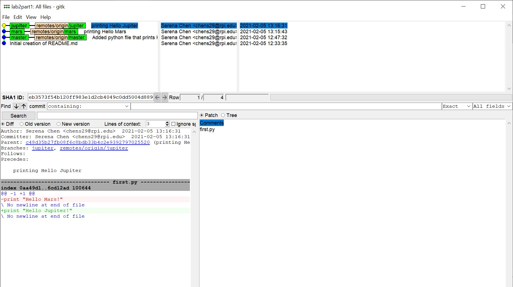

# Lab 02 Report - Introduction to Open Source Software

### Link to Lab 2 Part 1 Repo

### Screenshots of gitk and git log

### Fork of Spoon-Knife Repo

### Learn Git Branching

### PullReq

### Diffs

### Tagging

### Project Ideas Common Repository
