### Project Interests Wiki

### Latex
$\sqrt{1 + 2\sqrt{1 + 3\sqrt{1 + 4\sqrt{1 + \cdots}}}}$ \\
${{{{\sqrt{2}}^{\sqrt{2}}}^{\sqrt{2}}}^{\sqrt{2}}}^{\cdots}$
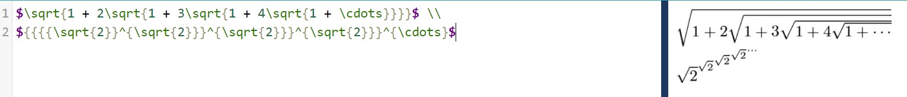

### Hadamard Matrix
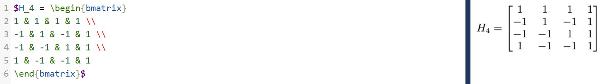

### RCOS Projects

#### YACS
1. 90 contributors
2. 44,6000 lines of code
3. first commit
>commit 58002dc5c721061a78a91a745f66d4833ad1468b  
Author: Jacob Shomstein <jacob@shomstein.com>  
Date:   Tue Feb 25 16:33:46 2020 -0500
4. latest commit
>commit 91062273d905d14a7ce30c9a5d13ccbaf3b2fe7d (HEAD -> master, origin/master, origin/HEAD)  
Author: Daniel Ackermans <35609442+marchdan@users.noreply.github.com>  
Date:   Thu Feb 4 00:15:17 2021 -0500
5. 23 branches total
>remotes/origin/#230  
remotes/origin/#259  
remotes/origin/280-loadPageSpinner  
remotes/origin/338-mobile-ui-revised  
remotes/origin/52-scheduling  
remotes/origin/HEAD -> origin/master  
remotes/origin/add_vuex  
remotes/origin/admin_panel_ui  
remotes/origin/coursePage-recommendation  
remotes/origin/create-pull-request/patch  
remotes/origin/csv-fix  
remotes/origin/dark-mode  
remotes/origin/fixTimeSpring2021CSV  
remotes/origin/master  
remotes/origin/page_for_department  
remotes/origin/s21  
remotes/origin/seo  
remotes/origin/showDatabaseError  
remotes/origin/shruti_yacs  
remotes/origin/spring_2021_update  
remotes/origin/subject_fail_reload  
remotes/origin/summer2020-demo  
remotes/origin/windows_support  

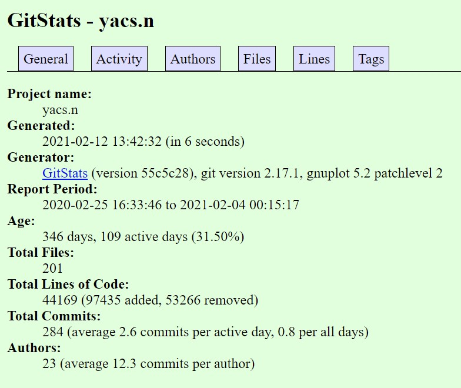

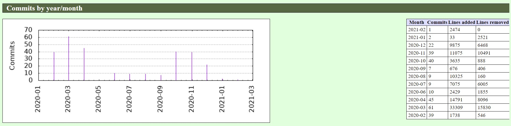

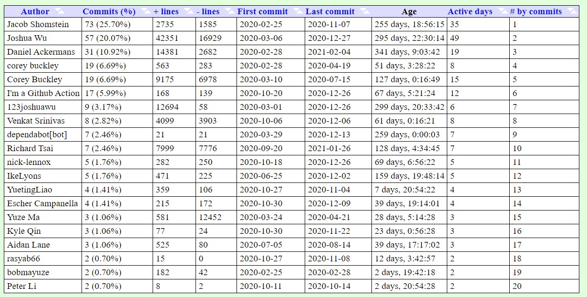

According to GitStats, YACS has been active for nearly a year now. They have 201 files and 44,169 lines of code in total. Although the YACS website lists 90 contributors, there are really only 23 authors. Looking at the activity graphs, we can see that most of the commits were made in February-April and October-December, which lines up with the Fall and Spring semesters. Jacob Shomstein is the author of the first commit; in fact, he made the most commits. However, Joshua Wu contributed with the most lines.

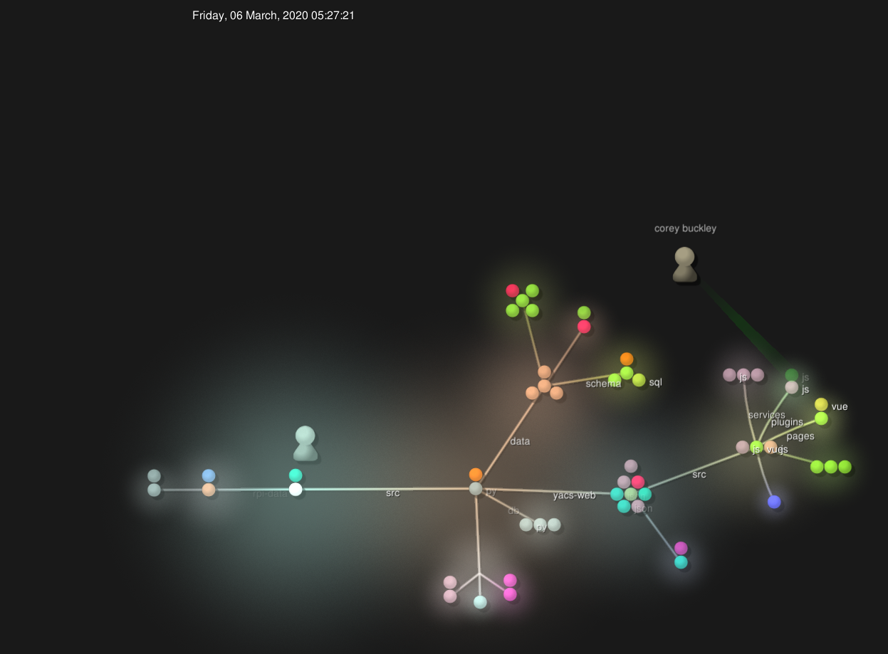

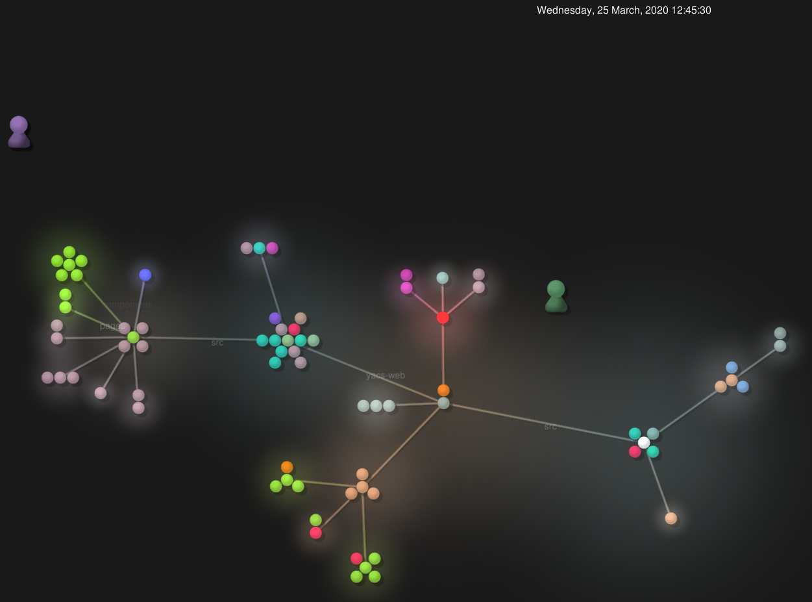

#### Pipeline
1. 15 contributors
2. 21,509 lines of code
3. first commit
>Commit: a6ad321cfc676e8fcf3ed9e9c054f31029966757  
Author: Sidney Kochman  
Date: September 2, 2016
4. latest commit
>Commit: dcec0a4cb1b425aa4afb5d109efa12ac70d33741  
Author: MacroLens Bot  
Date: December 10, 2020
5. 70 branches total
>remotes/origin/Bootswatch_dark_theme  
remotes/origin/DarkModeFinal  
remotes/origin/DarkTheme  
remotes/origin/DarkTheme2  
  remotes/origin/HEAD -> origin/master  
  remotes/origin/Make_interactive_map_of_troy  
  remotes/origin/VarunNair22-patch-1  
  remotes/origin/Windows_Learning_Journal  
  remotes/origin/active-staff-email  
  remotes/origin/archives  
  remotes/origin/articlePageSubtypesTwo  
  remotes/origin/bump-django-version  
  remotes/origin/css-fix  
  remotes/origin/database-url  
  remotes/origin/dep-bump  
  remotes/origin/dependabot/npm_and_yarn/acorn-6.4.1  
  remotes/origin/dependabot/npm_and_yarn/dot-prop-4.2.1  
  remotes/origin/dependabot/npm_and_yarn/elliptic-6.5.3  
  remotes/origin/dependabot/npm_and_yarn/jquery-3.5.0  
  remotes/origin/dependabot/npm_and_yarn/lodash-4.17.19  
  remotes/origin/dependabot/npm_and_yarn/node-sass-4.13.1  
  remotes/origin/dependabot/pip/django-2.2.13  
  remotes/origin/dependabot/pip/wagtail-2.7.4  
  remotes/origin/deployed-branch  
  remotes/origin/django  
  remotes/origin/elections-default-fix  
  remotes/origin/elections-page  
  remotes/origin/fix-build-readme-etc  
  remotes/origin/fix-css  
  remotes/origin/fix-draft-visibility  
  remotes/origin/fix-nginx  
  remotes/origin/fix-reqs  
  remotes/origin/fixed-deployment  
  remotes/origin/fixes  
  remotes/origin/forms  
  remotes/origin/forms_revised  
  remotes/origin/gallery-changes  
  remotes/origin/github_templates  
  remotes/origin/hash-fix  
  remotes/origin/home_page_blocks  
  remotes/origin/image-centering-issue  
  remotes/origin/image-sizing  
  remotes/origin/importer-enhancements  
  remotes/origin/linux-documentation-charlie  
  remotes/origin/master  
  remotes/origin/maybe-fix  
  remotes/origin/models  
  remotes/origin/photo-changes  
  remotes/origin/photo-gallery-enhancements  
  remotes/origin/photo-staff-pages  
  remotes/origin/previous-staff  
  remotes/origin/readme-fix  
  remotes/origin/revert-pr#132  
  remotes/origin/rss_feed  
  remotes/origin/sassReformat  
  remotes/origin/searchbar  
  remotes/origin/snippet  
  remotes/origin/staff-page-improvements  
  remotes/origin/staff_archive  
  remotes/origin/staff_page_mods  
  remotes/origin/stream  
  remotes/origin/stylingDocumentation  
  remotes/origin/test-2020-branch  
  remotes/origin/test-branch  
  remotes/origin/text-to-speech-v2  
  remotes/origin/text_to_speech  
  remotes/origin/timeline  
  remotes/origin/update-deps  
  remotes/origin/updating-frameworks  
  remotes/origin/views  

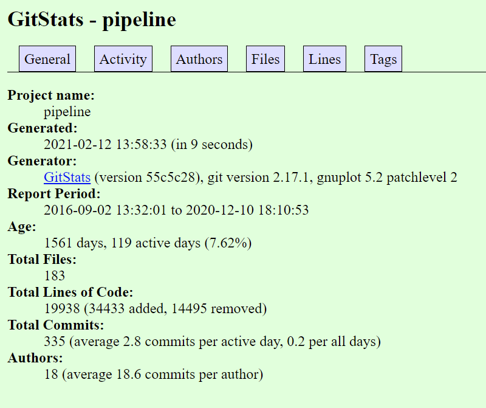

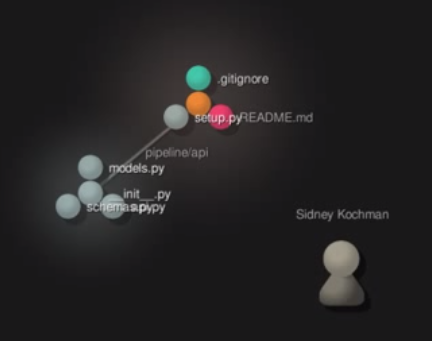

#### Shuttle Tracker
1. 30 contributors
2. 62,080 lines of code
3. first commit
>commit 3453b12cb6d53080a0967644eddf44111fef0c54  
Author: gabe283 <perez283@gmail.com>  
Date:   Tue Jan 27 19:24:05 2015 -0500
4. latest commit
>commit 3e8b9af6a7d8b341b605f137cf2b4577edd6bed3 (HEAD -> master, origin/master, origin/HEAD)  
Author: Matt Czyr <mattczyr@gmail.com>  
Date:   Fri Dec 4 17:52:44 2020 -0500
5. 57 branches total
>origin/HEAD -> origin/master  
  origin/Stop-Editing  
  origin/Stop-Editing-Dropdown  
  origin/TV-Panel  
  origin/TV-Panel-Fall2019  
  origin/april-1  
  origin/bus_button_always_on  
  origin/change-tabbar-size  
  origin/contribution-guidelines  
  origin/dark-theme  
  origin/debugRecording  
  origin/documentation  
  origin/dokku-nginx-conf  
  origin/eta_refactored  
  origin/export-routes  
  origin/feature_msg  
  origin/feedback  
  origin/feedback2  
  origin/github_corner  
  origin/master  
  origin/message-display  
  origin/notification_frontend  
  origin/notifications  
  origin/polyLine_overlap  
  origin/prediction_test  
  origin/readme-changes  
  origin/revert-271-dynamic-toggling  
  origin/route-changes-tab  
  origin/route-rewrite  
  origin/route-scheduling  
  origin/route_overlap  
  origin/route_toggling  
  origin/routes_cleanup  
  origin/sample-vue  
  origin/shuttle-slide  
  origin/smooth-track-debug  
  origin/smooth-tracking  
  origin/smooth-tracking-algorithm  
origin/smooth-tracking-algorithm-2  
  origin/smooth-tracking-algorithms  
  origin/smooth-tracking-predict-light-stops  
  origin/smooth-tracking-predict-turns  
  origin/smooth-tracking-slide  
  origin/smooth-tracking-test  
  origin/smooth_tracking_debug  
  origin/spoof  
  origin/spoof-f20  
  origin/stop_ordering  
  origin/stops-editing  
  origin/test  
  origin/toggle-routes  
  origin/tv-panel  
  origin/typescriptvue  
  origin/update-headings  
  origin/update_Package  
  origin/vehicle-stop-location  

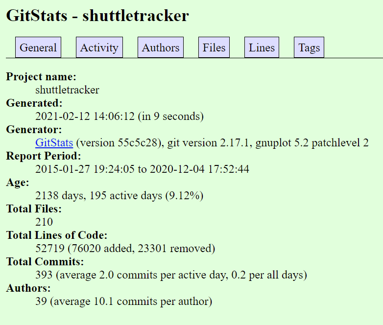

There were actually 39 different authors and 52719 lines of code with 210 active files. Sidney Cochman was the author with the most commits and has the most lines written. It is a very old repo, almost 6 years old. It saw a high amount of commits in the beginning few years but has slowed down a bit.

#### Poll Buddy
1. 24 contributors
2. 28,239 lines of code
3. first commit
>commit af1c1a0a26b2f6babc65d9a1258ddb1aa21768d9  
Author: neha-deshpande001  
Date: Tue Sep 17 16:13:57 2019 -0400  
“Initial commit”
4. latest commit
>commit 3942bbc599f82033541cef62d4176e4b7c0982d0 (HEAD -> email-system, origin/email-system)  
Author: hbh7  
Date: Tue Feb 9 16:28:18 2021 -0500  
“Small info comment”
5. 8 branches total
>remotes/origin/HEAD -> origin/master  
  remotes/origin/backend  
  remotes/origin/email-system  
  remotes/origin/frontend  
  remotes/origin/instructor_view  
  remotes/origin/issue-387  
  remotes/origin/master  
  remotes/origin/questionEditorFunctionality  
  remotes/origin/users-docs

GitStats shows that the project has 27,772 lines of code in total and 35 authors. I’m guessing the difference in lines of code is because GitStats potentially does not include non-code files like READMEs. Activity mostly stopped about 2 months ago (9 weeks) but has picked up slowly within the past week. This explains the most recent commit happening on February 9th in the email-system branch. A large portion of the commits happen at 16:00 and on Tuesdays/Fridays, which makes sense since this is when RCOS is ongoing.

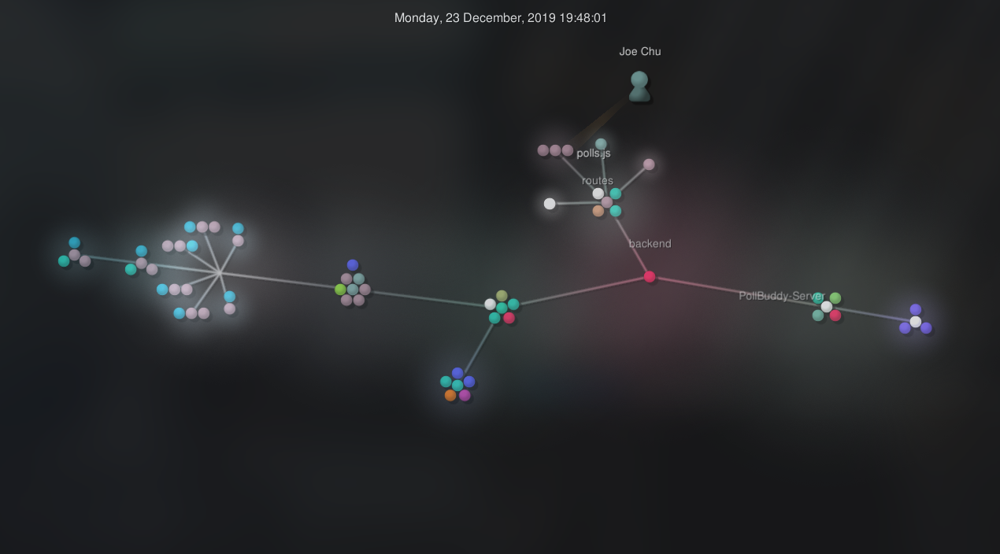

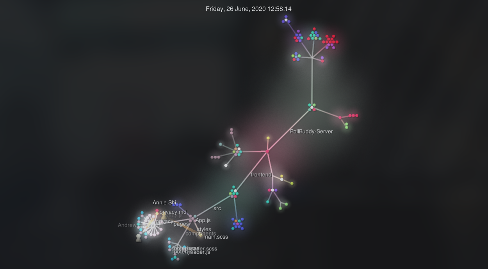
