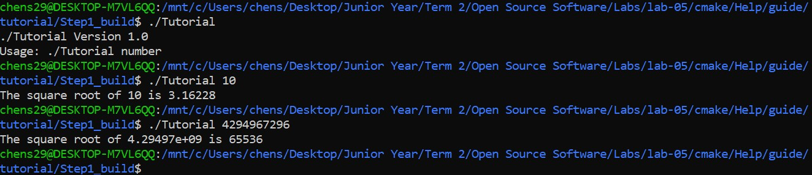
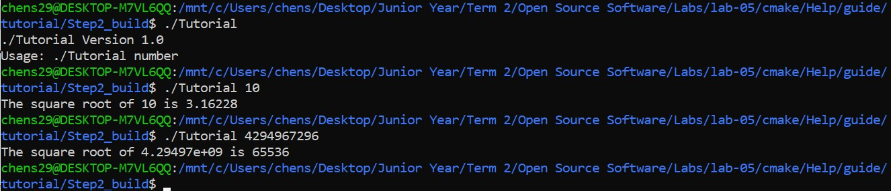
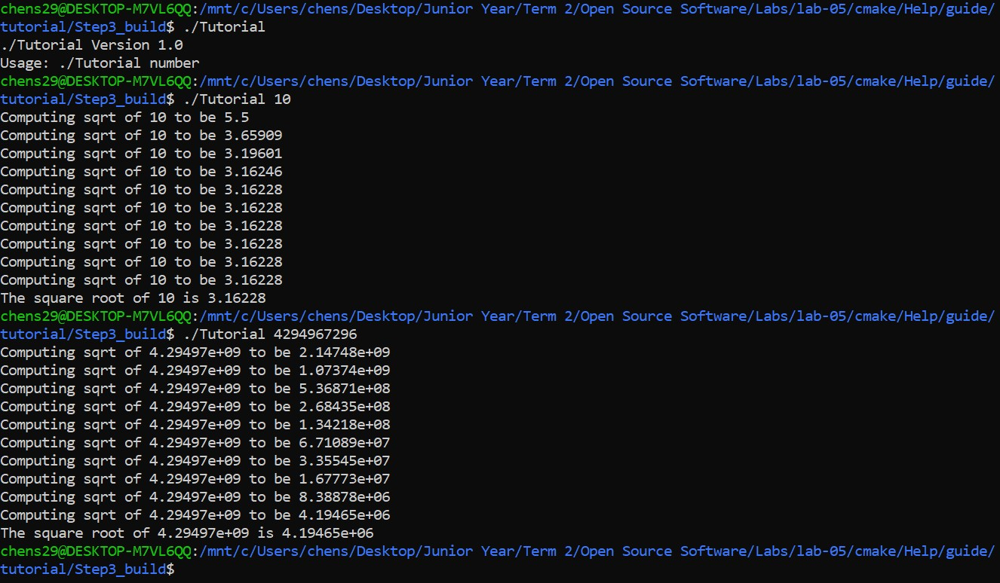
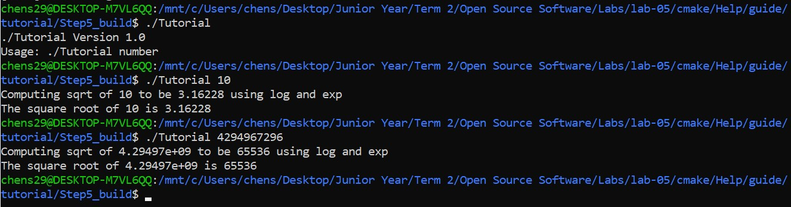
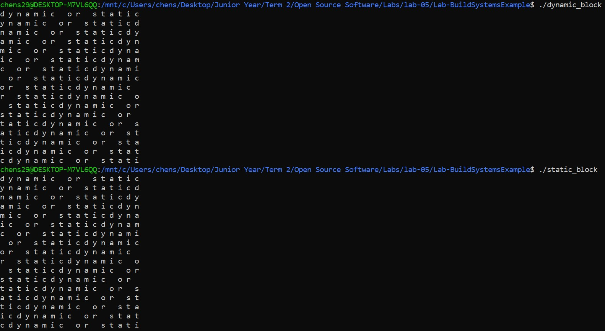

## CMake Tutorial

### Step 1
###### Output

###### CMakeLists
[Step 1 CMakeLists](Step1/CMakeLists.txt)
###### Tutorial
[Step 1 Tutorial](Step1/tutorial.cxx)

### Step 2
###### Output

###### CMakeLists
[Step 2 CMakeLists](Step2/CMakeLists.txt)
###### Tutorial
[Step 2 Tutorial](Step2/tutorial.cxx)

### Step 3
###### Output

###### CMakeLists
[Step 3 CMakeLists](Step3/CMakeLists.txt)
###### MathFunctions/CMakeLists
[Step 3 MathFunctions/CMakeLists](Step3/MathFunctions/CMakeLists.txt)

### Step 4
###### Output
[Step 4 Output](Step4/output.txt)
###### CMakeLists
[Step 4 CMakeLists](Step4/CMakeLists.txt)
###### MathFunctions/CMakeLists
[Step 4 MathFunctions/CMakeLists](Step4/MathFunctions/CMakeLists.txt)

### Step 5
###### Output

###### CMakeLists
[Step 5 CMakeLists](Step5/CMakeLists.txt)
###### MathFunctions/CMakeLists
[Step 5 MathFunctions/CMakeLists](Step5/MathFunctions/CMakeLists.txt)

## Lab-BuildSystemsExample
### Output

### Size Comparisons
[Block Size Comparisons](Block/sizes.jpg)
### Makefile
[Block Makefile](Block/Makefile)
### CMakeLists
[Block CMakeLists](Block/CMakeLists.txt)
